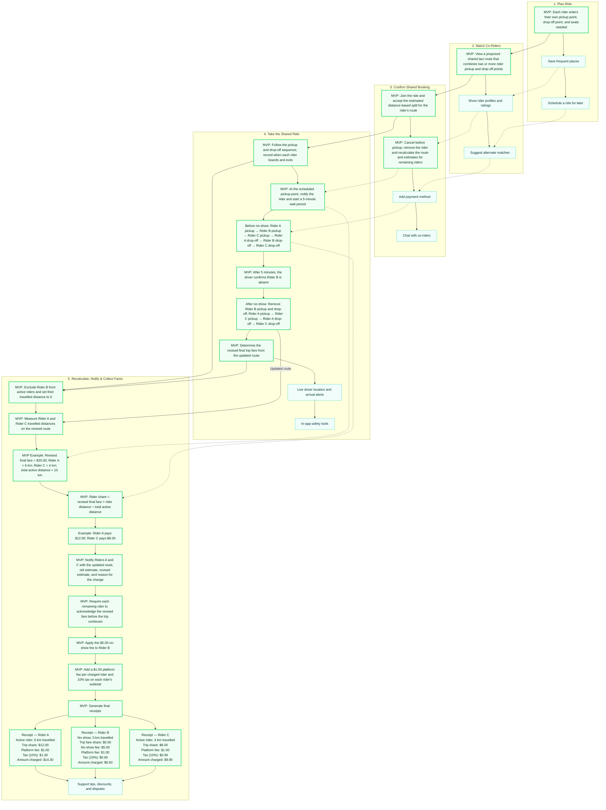

# Shared Taxi — User Story Map

## Overview

This project models a shared-taxi booking system where multiple riders can share a vehicle. The system allows riders to plan trips, match with co-riders, confirm bookings, manage no-shows, recalculate fares, and generate final receipts.

The user story map is organized around the complete rider journey and separates **MVP functionality** from later enhancements.

## User Journey

The main journey is:

**Plan Ride → Match Co-Riders → Confirm Booking → Take Shared Ride → Recalculate, Notify & Collect Fares**

## User Story Map



## MVP Scope

The MVP focuses on the complete end-to-end shared-ride journey:

1. **Plan the ride**
2. **Match co-riders**
3. **Confirm the shared booking**
4. **Take the shared ride**
5. **Handle a no-show**
6. **Recalculate the route**
7. **Recalculate rider fares**
8. **Notify remaining riders**
9. **Apply the no-show fee**
10. **Generate final receipts**

## Fare Calculation

The MVP uses a distance-based allocation:

```text
Rider Share =
Revised Final Fare × Rider Distance
÷ Total Active Rider Distance
```

### Example

```text
Revised final fare = $20.00

Rider A = 6 km
Rider C = 4 km

Total active distance = 10 km

Rider A:
$20 × 6 ÷ 10 = $12.00

Rider C:
$20 × 4 ÷ 10 = $8.00
```

## No-Show Scenario

If Rider B does not arrive within the **5-minute waiting period**:

* Rider B is removed from the active riders.
* Rider B's travelled distance becomes `0 km`.
* Rider B's pickup and drop-off are removed from the route.
* The route is recalculated for Riders A and C.
* The final fare is recalculated.
* Riders A and C receive updated fare information.
* Rider B receives a `$5.00` no-show fee.
* Final receipts are generated for all riders.

## Future Enhancements

Features outside the MVP include:

* Saving frequent places
* Scheduled rides
* Rider profiles and ratings
* Alternative co-rider matching
* Payment methods
* In-app chat
* Live driver location
* Arrival alerts
* In-app safety tools
* Support for tips, discounts, and disputes

## Key Agile / SAD Concepts Demonstrated

This user story map demonstrates:

* **User Story Mapping**
* **MVP / Walking Skeleton**
* **End-to-End User Journey**
* **Acceptance Criteria**
* **Business Rules**
* **Event-driven thinking**
* **Continuous value delivery**
* **Requirements decomposition**
* **Vertical slicing**
* **Fare recalculation**
* **Exception handling**

## Technology / Documentation

The diagram uses **Mermaid**, which can be rendered directly by GitHub inside a Markdown file.
